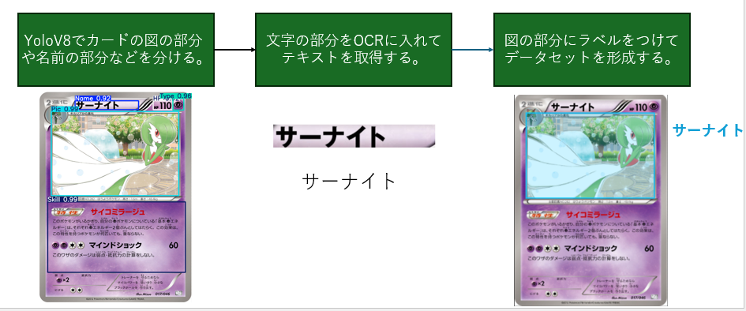
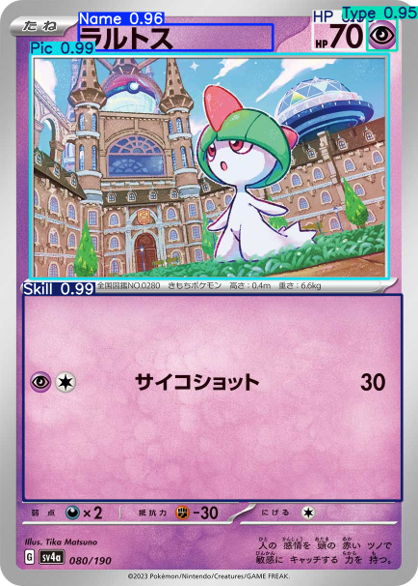

# ポケモンカードを使ってVoloV8データセットを迅速に作成するツール

## 全体的な流れ

## カードの要素抽出モデル訓練

### データ取得
- /getOriginalData
- [Web Scraper](https://webscraper.io/)（クローラ）で[オフィシャルサイト](https://www.pokemon-card.com/card-search)から1000枚ぐらい抽出する。

### 要素ラベリング

- 手動で一枚に要素のラベルを付けて全体へコピペする。
    
    - Name
    - Picture
    - HP
    - Type
    - Skill

### Yolo訓練

- /modelTrain/main.ipynb
- Platform == google Colab
- Model == yolov8n.pt
- Data : Valid : Test == 7 : 3 : 1
- Epochs == 50

## メインプロセス

- /finalMake/main.ipynb
- 要素抽出モデル導入する。
- モデルでカードの名前とキャラクター図を抽出する。
- Azure OCRのAPIで名前を文字列に変換させる。
- キャラクター図の部分をbboxにして、名前の文字列をラベルにして付ける。